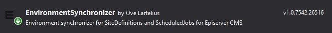

# Episerver CMS environment synchronizer
When synchronizing databases between environments there might be things that needs to be configured for each environment.
This addon provides the infrastructure to add handlers to handle this, including prebuilt handlers for siteDefinitions and ScheduledJobs that can be configured in configuration files (a.k.a. web.config)
  
The synchronizer can be run as a InitializationModule or as a ScheduledJob. It depends on what you think is fitting your environment and project.

## Installation
This will be packaged as a Nuget package named Addon.Episerver.EnvironmentSynchronizer and put in Episervers Nuget feed once tested a bit more.


## Configuration
Example web.config
```xml
<configuration>
  <configSections>
    <section name="env.synchronizer" type="Addon.Episerver.EnvironmentSynchronizer.Configuration.SynchronizerSection" allowLocation="true" allowDefinition="Everywhere" />
  </configSections>
	<env.synchronizer runAsInitializationModule="true">
		<sitedefinitions>
			<sitedefinition Id="" Name="AlloyDemo" SiteUrl="http://localhost:58288/">
				<hosts>
					<host Name="*" UseSecureConnection="false" Language="" />
					<host Name="local.alloydemo.se" UseSecureConnection="false" Language="en" />
				</hosts>
			</sitedefinition>
		</sitedefinitions>
		<scheduledjobs>
			<scheduledjob Id="*" Name="*" IsEnabled="false" />
			<scheduledjob Name="YourScheduledJob" IsEnabled="true" />
		</scheduledjobs>
	</env.synchronizer>
```

## Adding custom handlers
You can add custom handlers by creating and registering a class that implements IEnvironmentSynchronizer

using Addon.Episerver.EnvironmentSynchronizer;
using EPiServer.ServiceLocation;

namespace Yoursite.Infrastructure.Environments
{
    [ServiceConfiguration(typeof(IEnvironmentSynchronizer))]
    public class TestEnvironmentSynchronizer : IEnvironmentSynchronizer
    {
        public void Synchronize(string environmentName)
        {
            //TODO: Do something
        }
    }
}

## About environments
Episerver has many different ways to be hosted. We have added the infrastructure to tell your synchronizers the current environment - but you need to implement the logic for this yourself. For instance:

using Addon.Episerver.EnvironmentSynchronizer;
using EPiServer.ServiceLocation;
using System.Configuration;

namespace Yoursite.Infrastructure.Environments
{
    [ServiceConfiguration(typeof(IEnvironmentNameSource))]
    public class SiteEnvironmentNameSource : IEnvironmentNameSource
    {
        public string GetCurrentEnvironementName()
        {
            return ConfigurationManager.AppSettings["EnvironmentName"];
        }
    }
}

### runAsInitializationModule
Tells the synchronizer that you want to run it as InitializationModule.

### sitedefinition
**Id** is the GUID that identify the site. If this is provided it will ignore the "Name" attribute.
**Name** is the name of the sitedefinition that will be updated. If **Id** is not specified it will match the existing SiteDefinition in the Episerver CMS against this name.
**SiteUrl*** is the SiteUrl that this site should have/use. If the existing SiteDefinition that are found with Id/Name in Episerver CMS already have a SiteUrl. The SiteDefinition in Episerver CMS will not be updated.

### hosts
You need to specify all the hosts that the site needs. When the synchronizer is updating a SiteDefinition it will expect that you have specified all hostnames. So of you in Episerver CMS has a extra host that is not specified in the web.config it will be removed.

### host
**Name** is the hostname. Example local.alloydemo.se  
**UseSecureConnection** specify if it is a http/https URL.  
**Type** is the type of the host. It is the enum EPiServer.Web.HostDefinitionType that are used by Episerver CMS. If the Type is not specified it will be set to `Undefined`.  
Options (EPiServer.Web.HostDefinitionType [Enum]):  
- **Undefined**
- **Edit**
- **Primary**
- **RedirectPermanent**
- **RedirectTemporary**
**Language** is the CultureInfo that is related to the hostname  

## scheduledjobs
You can specify 0 to many Scheduledjob that should be updated.

### schedulejob
**Id**: If Id is specified then the synchronizer will ignore the Name and find the scheduled job that match the Id.  
**Name** The name of the job that you want to update. You can use `*` as a wildcard. That means that it will go through all ScheduledJobs in Episerver CMS and enabled/disabled them. So you should have this as the first definition in the configuration.  
Example:  
```xml
  <schedulejobs>
    <schedulejob Id="*" Name="*" IsEnabled="false" />
    <schedulejob Name="Episerver-notification" IsEnabled="true" />
  </schedulejobs>
```  
In this example it first go through all ScheduledJobs and disable them. And then it will enable the job "Episerver-notification".
**IsEnabled** [bool] set if the job should be enabled/disabled. 
